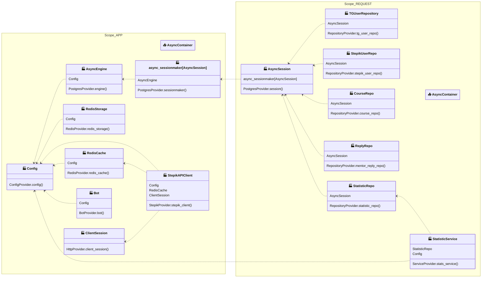

# Stepik Mentor Metric Bot

A Telegram bot for tracking mentor activity metrics on the Stepik platform. Automatically collects comments, calculates statistics, and generates reports for course mentors.

## Features

- **Mentor Management**: Add/remove mentors via Stepik profile links
- **Course Tracking**: Monitor multiple Stepik courses for new comments
- **Automatic Polling**: Fetches comments every 180 seconds with intelligent 
  caching
- **Statistics Aggregation**: Daily and monthly reports with efficiency metrics
- **Smart Cold Start**: Configurable historical data polling (2 days dev / 30 
  days prod)
- **Admin Reports**: Automated and manual daily/monthly statistics sent to admins

## Metrics Calculation

The bot calculates mentor performance using two key metrics:

### EF (Efficiency Index)

Measures the quality of mentor responses based on AI-classified usefulness:

```
EF = (useful_replies²) / total_replies
```

Where:
- `useful_replies` — responses marked as meaningful by AI (`is_useful_comment=True`)
- `total_replies` — total number of mentor responses

**Examples:**
- 10 useful / 10 total = (10² / 10) = **10.0**
- 8 useful / 10 total = (8² / 10) = **6.4**
- 10 useful / 20 total = (10² / 20) = **5.0**

Higher is better. Maximum achieved when 100% of responses are useful.

### Speed Index (⚡️)

Percentile-based ranking of response speed (0–100 scale):

```
speed = (N - rank + 1) / N × 100
```

Where:
- `N` — total number of active mentors
- `rank` — position in sorted list by `avg_delay` (fastest = rank 1)
- `avg_delay` — average time between student question and mentor reply

**Interpretation:**
- **100** — fastest responder
- **0** — slowest responder

## Technology Stack

| Component            | Technology                                        |
|----------------------|---------------------------------------------------|
| **Language**         | Python 3.14                                       |
| **Bot Framework**    | aiogram 3.x + aiogram-dialog                      |
| **DI Container**     | Dishka                                            |
| **Database**         | PostgreSQL 18 + SQLAlchemy 2.0 (Async)            |
| **Migrations**       | Alembic                                           |
| **Cache/FSM**        | Redis 8                                           |
| **Task Queue**       | Taskiq (Redis Stream Broker)                      |
| **Scheduler**        | Taskiq Scheduler (PostgreSQL source)              |
| **Config**           | Dynaconf + Pydantic                               |
| **Package Manager**  | uv                                                |
| **Containerization** | Docker + Docker Compose                           |
| **Code Quality**     | Ruff (linting/formatting)<br/> Ty (type checking) |

## Project Structure

```text
.
.
├── src/
│   ├── alembic/                  # Database migrations
│   │   ├── versions/             # Migration version files
│   │   └── env.py                # Environment for running migrations
│   ├── bot/                      # Telegram bot logic
│   │   ├── commands.py           # Managing bot commands
│   │   ├── dialogs/              # Dialogs aiogram-dialog
│   │   │   ├── common/           # Common Dialog Components
│   │   │   │   ├── filters.py    # Filters
│   │   │   │   ├── getters.py    # Common data getters
│   │   │   │   ├── handlers.py   # Common handlers
│   │   │   │   ├── validators.py # Link validators
│   │   │   │   └── widgets.py    # Repeating buttons
│   │   │   ├── flows/            # Specific dialogue threads
│   │   │   │   ├── courses/      # Course management 
│   │   │   │   ├── mentors/      # Mentor management 
│   │   │   │   ├── start/        # Main menu 
│   │   │   │   └── statistic/    # Statistics reports 
│   │   │   └── __init__.py       # Registering ROUTERS for Dispatcher
│   │   └── middlewares/
│   │       └── acl.py            # Middleware for access control
│   ├── core/                     # Application core
│   │   ├── logger.py             # Setting up logging
│   │   └── main_config.py        # Configuration via Dynaconf and Pydantic
│   ├── db/                       # Database Layer
│   │   ├── models/               # Models SQLAlchemy
│   │   │   ├── author_reply.py
│   │   │   ├── base.py
│   │   │   ├── course.py
│   │   │   ├── mentor_statistic.py
│   │   │   ├── mixins.py         # TimestampMixin for models
│   │   │   ├── stepik_user.py
│   │   │   └── telegram_user.py
│   │   └── repository/           # Repositories (Data Access Layer)
│   │       ├── course_repo.py
│   │       ├── reply_repo.py
│   │       ├── statistic_repo.py
│   │       ├── stepik_user_repo.py
│   │       └── tg_user_repo.py
│   ├── infrastructure/           # External integrations
│   │   ├── di/                   # Dependency Injection (Dishka)
│   │   │   └── providers/        # Dependency Providers
│   │   └── stepik/
│   │       └── client.py         # Client for Stepik API
│   ├── services/                 # Business logic
│   │   └── statistic_service.py  # Metric calculation and aggregation 
│   ├── tasks/                    # Background tasks
│   │   ├── broker.py             # Initialization RedisStreamBroker 
│   │   ├── mixins.py             # Mixins
│   │   ├── scheduler.py          # Scheduler logic and CLIENT_STARTUP
│   │   ├── setup.py              # Setting up a worker 
│   │   └── tasks.py              # Definitions of the tasks 
│   └── main.py                   # Application entry point
├── tests/                        # Tests
├── .env.example                  # Example environment variables
├── alembic.ini                   # Alembic config
├── docker-compose.dev.yml        # Docker for development
├── docker-compose.prod.yml       # Docker for production
├── Dockerfile                    # Multi-stage assembly
├── migrate.sh                    # Migration automation script
├── pyproject.toml                # Dependencies and Settings
└── settings.toml                 # Settings
```

## Quick Start

### Prerequisites

- Docker & Docker Compose
- Telegram Bot Token (from @BotFather)
- Stepik API Credentials (Client ID & Secret)
- Redis & PostgreSQL (included in Docker Compose)

### 1. Clone and Configure

```bash
git clone <repository-url>
cd stepik-mentor-metric-bot
cp .env.example .env
```
### 2. Edit ```.env```
```dotenv
APP_TAG=<actual-tag>
ENV_FOR_DYNACONF=production
BOT_TOKEN=your_telegram_bot_token

# Stepik
STEPIK_CLIENT_ID=your_stepik_client_id
STEPIK_CLIENT_SECRET=your_stepik_client_secret

# Redis
REDIS_PASSWORD=your_redis_password
REDIS_HOST=redis

# PostgreSQL
POSTGRES_USER=superuser
POSTGRES_PASSWORD=your_secure_password
POSTGRES_HOST=postgres_db
POSTGRES_DB=mentor_db
```
### 3. Run with Docker Compose
```bash
# Production
docker compose -f docker-compose.prod.yml up -d

# Development (with hot reload)
docker compose -f docker-compose.dev.yml up -d
```
### 4.  Check Logs
```bash
docker compose -f docker-compose.prod.yml logs -f bot
docker compose -f docker-compose.prod.yml logs -f worker
docker compose -f docker-compose.prod.yml logs -f scheduler
```
## Development

### Local Setup with uv
```bash
# Install uv (if not installed)
curl -LsSf https://astral.sh/uv/install.sh | sh

# Create virtual environment and install dependencies
uv sync --dev

# Run the bot
uv run python src/main.py
```

## Database Migrations
Use the automated migration script:
```bash
# Create and test a new migration
./migrate.sh "your_migration_description"
```
The script performs:
1. Starts the database container
2. Generates migration with `alembic revision --autogenerate`
3. Test Drive: Upgrade → Downgrade → Upgrade
4. Runs `alembic check` for model compliance
5. Stops the database

## Manual Alembic Commands
```bash
# Generate migration
docker compose -f docker-compose.dev.yml run --rm bot alembic revision --autogenerate -m "description"

# Apply migrations
docker compose -f docker-compose.dev.yml run --rm bot alembic upgrade head

# Check model compliance
docker compose -f docker-compose.dev.yml run --rm bot alembic check

# Rollback one version
docker compose -f docker-compose.dev.yml run --rm bot alembic downgrade -1
```

## Code Quality
```bash
# Format code
uv run ruff format src/

# Lint code
uv run ruff check src/

# Type checking (ty)
uv run ty src/
```
## API Integration
### Stepik OAuth2
- expires_in=36000 seconds (10 hours)
1. The bot automatically:
2. Requests OAuth2 token from Stepik
3. Caches token in Redis (TTL: expires_in - 300 seconds)
4. Refreshes token on 401 Unauthorized
5. Handles rate limiting (429) with retry

## Cached Endpoints

* stepik_token — OAuth2 access token (Redis DB 1)
* courses_ids — Active course IDs (Redis DB 1, TTL: 1h)
* users_ids — Mentor IDs (Redis DB 1, TTL: 1h)
* time:course:{id} — Last poll timestamp per course

## Security
* Non-root user (appuser) in production container
* Secrets managed via environment variables
* PostgreSQL and Redis not exposed externally (internal network only)
* Passwords validated (min 7 characters) via Pydantic

##  Operating bot instructions after first start 
### For the “cold start” to work correctly, it is important to follow the sequence actions in the bot:
1. First add Mentors: The bot must know the IDs of mentors in order to correctly 
flag their responses during the initial history scan.
2. Then add Courses: Once the course is added, the system will start aggregation 
   statistics for the past month.

# Dependency Injection Graph




